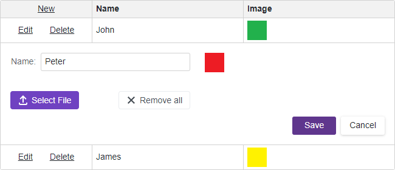

<!-- default badges list -->

[](https://supportcenter.devexpress.com/ticket/details/T873926)
[](https://docs.devexpress.com/GeneralInformation/403183)
<!-- default badges end -->

# Grid for Blazor - How to use DxUpload component to upload images to the grid

This example demonstrates how to use the [DxUpload](https://docs.devexpress.com/Blazor/DevExpress.Blazor.DxUpload) component inside the grid edit form template to upload images to the server and then display them in the grid.




In this example, the data source contains paths to images that are maintained on the server. [DxGrid](https://docs.devexpress.com/Blazor/DevExpress.Blazor.DxGrid) displays the images in the cell template ([CellDisplayTemplate](https://docs.devexpress.com/Blazor/DevExpress.Blazor.DxGridDataColumn.CellDisplayTemplate)).

```razor
<DxGridDataColumn FieldName=@nameof(TestModel.ImageUrl) Caption="Image">
    <CellDisplayTemplate>
        
    </CellDisplayTemplate>
</DxGridDataColumn>
```

The grid edit form template ([EditFormTemplate](https://docs.devexpress.com/Blazor/DevExpress.Blazor.DxGrid.EditFormTemplate)) contains [DxUpload](https://docs.devexpress.com/Blazor/DevExpress.Blazor.DxUpload) component that allows you to upload images to the server. 


```razor
<EditFormTemplate Context="EditFormContext">
    @{
        var item = (TestModel)EditFormContext.EditModel;
    }
    <DxFormLayout CssClass="w-100">
        <DxFormLayoutItem Caption="Name:">
            <DxTextBox @bind-Text="@item.Name" />
        </DxFormLayoutItem>
        <DxFormLayoutItem>
            
        </DxFormLayoutItem>
        <DxFormLayoutItem>
            <DxUpload Name="ImageUpload" FileUploaded="@((args) => OnFileUploaded(args, item))"
                UploadUrl="@GetUploadUrl("/api/Upload/UploadFile/")" ChunkSize="20000" ShowFileList="false"
                AllowedFileExtensions="@(new List<string> { ".jpg", ".jpeg", ".gif", ".png" })">
            </DxUpload>
        </DxFormLayoutItem>
    </DxFormLayout>
</EditFormTemplate>
```

After an image is uploaded, the [FileUploaded](https://docs.devexpress.com/Blazor/DevExpress.Blazor.DxUpload.FileUploaded) event handler saves the image's path to the corresponding row's edit model.

```csharp
protected void OnFileUploaded(FileUploadEventArgs args, TestModel item) {
    var fileUrl = _fileUrlStorageService.Get(Guid.Parse(args.FileInfo.Guid));
    item.ImageUrl = fileUrl;
}
```

<!-- default file list -->
## Files to Review

* [Index.razor](./CS/UsingUploadEditDataGrid/Pages/Index.razor)
* [UploadController.cs](./CS/UsingUploadEditDataGrid/Controllers/UploadController.cs)
* [FileUrlStorageService.cs](./CS/UsingUploadEditDataGrid/Data/FileUrlStorageService.cs)
* [TestModelService.cs](./CS/UsingUploadEditDataGrid/Data/TestModelService.cs)
<!-- default file list end -->

## Documentation

* [Edit Data and Validate Input](http://docs.devexpress.devx/Blazor/403454/grid/edit-data-and-validate-input)
